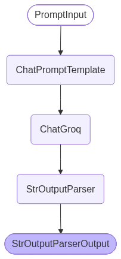
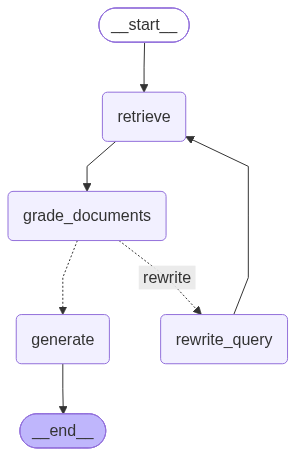

# Adaptive RAG (CRAG) POC

## Project Overview
This project is an enterprise-grade Proof of Concept (POC) demonstrating **Corrective Retrieval-Augmented Generation (CRAG)**. It provides a side-by-side comparison between a standard linear RAG pipeline (built with **LangChain**) and an adaptive, self-correcting graph-based RAG pipeline (built with **LangGraph**).

---

## The Problem
Standard linear RAG operates on a single-shot `Retrieve → Generate` paradigm:
1. When a user submits a query that uses colloquial phrasing, synonyms, or conceptual terms, vector search often retrieves tangential or distracting chunks.
2. Standard RAG blindly passes these poor chunks to the LLM, leading to hallucinations or unhelpful *"I don't know"* refusals.
3. It has no feedback mechanism to evaluate retrieval quality or self-correct.

### The Solution: Corrective RAG (CRAG)
CRAG introduces an **active evaluation circuit**:
- **Document Grading Node**: An LLM acts as an evaluator, grading whether retrieved documents contain factual context relevant to the user query.
- **Dynamic Query Rewriting**: If retrieved context is insufficient or noisy, the system reformulates the query into formal technical terminology.
- **Stateful Retries**: LangGraph executes a cyclical feedback loop (up to `MAX_RETRIES`) to re-retrieve documents before generating the grounded answer.

---

## Flow Comparison & Architecture

### 1. LangChain Flow (Baseline Single-Shot RAG)

Visualized directly from `chain.get_graph().draw_mermaid_png()`:

<p align="center">
  
</p>

### 2. LangGraph Flow (Self-Correcting CRAG)

Visualized directly from compiled `workflow.get_graph().draw_mermaid_png()`:

<p align="center">
  
</p>

---

## Directory & Folder Structure

```
crag/
│
├── assets/
│   ├── langchain_graph.png            # Flow diagram for LangChain baseline
│   └── langgraph_graph.png            # Flow diagram for LangGraph CRAG loop
│
├── data/
│   ├── documents/                     # Raw knowledge base files (PDFs + TXTs)
│   │   ├── *.pdf                      # 12 Research Papers (AI, Medical, Remote Sensing)
│   │   └── doc1.txt - doc8.txt        # Structured scenario & distractor documents
│   └── chroma_db/                     # Persistent local Chroma vector database cache
│
├── src/
│   ├── config.py                      # Global paths, environment variables & hyperparameters
│   │
│   ├── ingestion/
│   │   └── loader.py                  # Document loaders (DirectoryLoader, PyPDFLoader) & TextSplitters
│   │
│   ├── llm/
│   │   └── factory.py                 # LLM (Groq API) & HuggingFace Embedding factory
│   │
│   ├── retrieval/
│   │   ├── vector_store.py            # Chroma vector store persistence & indexing
│   │   └── retriever.py               # Configured retriever interface
│   │
│   ├── prompts/
│   │   └── templates.py               # Domain-agnostic templates (RAG, Grading, Rewrite)
│   │
│   ├── models/
│   │   └── state.py                   # TypedDict schema for LangGraph state & execution traces
│   │
│   ├── flows/
│   │   ├── langchain_rag.py           # Linear Baseline RAG implementation
│   │   └── langgraph_crag.py          # Cyclical CRAG StateGraph implementation
│   │
│   └── utils/
│       └── formatting.py              # Context formatting & TraceStep dataclasses
│
├── app.py                             # Streamlit UI dashboard with interactive execution tracing
├── requirements.txt                   # Project dependencies
├── testing.txt                        # Benchmark test scenarios & evaluation queries
├── .env.example                       # Environment variables template
├── .env                               # Local secrets (API keys)
└── README.md                          # Main project documentation
```

---

## Setup & Installation

### 1. Prerequisites
- Python 3.10+
- Free Groq API Key ([https://console.groq.com](https://console.groq.com))

### 2. Environment Setup
```bash
# Clone the repository
git clone https://github.com/your-username/crag.git
cd crag

# Create and activate a virtual environment
# On Windows:
python -m venv venv
.\venv\Scripts\Activate.ps1

# On Linux/macOS:
python -m venv venv
source venv/bin/activate

# Install dependencies
pip install -r requirements.txt
```

### 3. Configure Environment Variables
Copy `.env.example` to `.env` and provide your Groq API key:
```env
GROQ_API_KEY=gsk_your_groq_api_key_here
LLM_MODEL=openai/gpt-oss-20b
TOP_K=2
MAX_RETRIES=2
```

---

## Running the Application

Launch the Streamlit interactive dashboard:
```bash
streamlit run app.py
```
Open **`http://localhost:8501`** in your browser.

---

## Key Benchmark Scenarios

| Scenario | Sample Query | LangChain (Baseline) | LangGraph (CRAG) |
| :--- | :--- | :--- | :--- |
| **1. Self-Correction Showcase** | *"How do researchers map different Earth terrain types and what spatial resolution bands were utilized from the European satellite?"* | ❌ **Refusal:** Retrieves tangential ATLAS chunks $\rightarrow$ *"I don't know"* | ✅ **Recovers:** Grades docs as insufficient $\rightarrow$ Rewrites query $\rightarrow$ Retrieves ENVISAT MERIS/MODIS bands $\rightarrow$ Answers accurately |
| **2. Fast Technical Parity** | *"What specific accuracy score was achieved by the novel convolutional neural network model when diagnosing lung cancer on CT scan images?"* | ✅ **Direct Answer:** 100% testing accuracy | ✅ **Direct Answer:** 100% accuracy (Skips rewrites on valid pass 1) |
| **3. Negative / Out-of-Domain** | *"What was the battery efficiency of the electric vehicle powertrain tested in the 2025 automotive study?"* | 🛡️ **Declines:** Avoids hallucinations | 🛡️ **Declines:** Avoids hallucinations |

---

## Tech Stack & Components

- **Orchestration**: LangGraph, LangChain
- **LLM Provider**: Groq Cloud (`openai/gpt-oss-20b`)
- **Embeddings**: HuggingFace `sentence-transformers/all-MiniLM-L6-v2` (Local, zero cost)
- **Vector Database**: ChromaDB (with persistent disk storage)
- **Frontend UI**: Streamlit
- **Document Processing**: PyPDF, LangChain Community Loaders & Splitters
